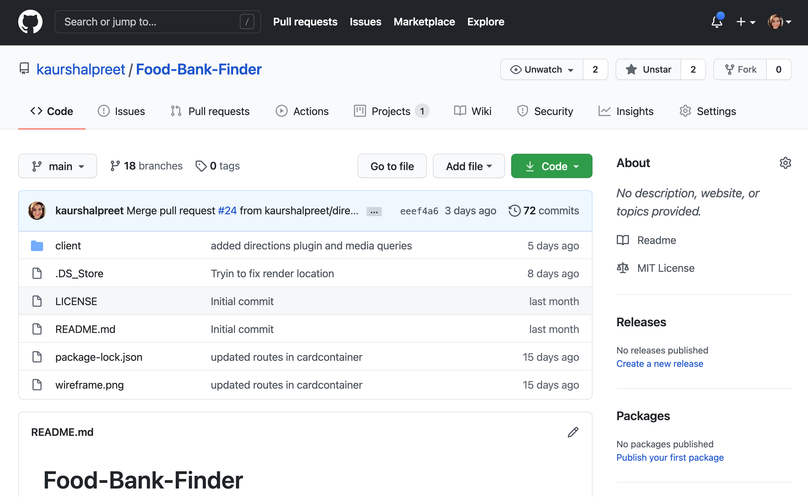
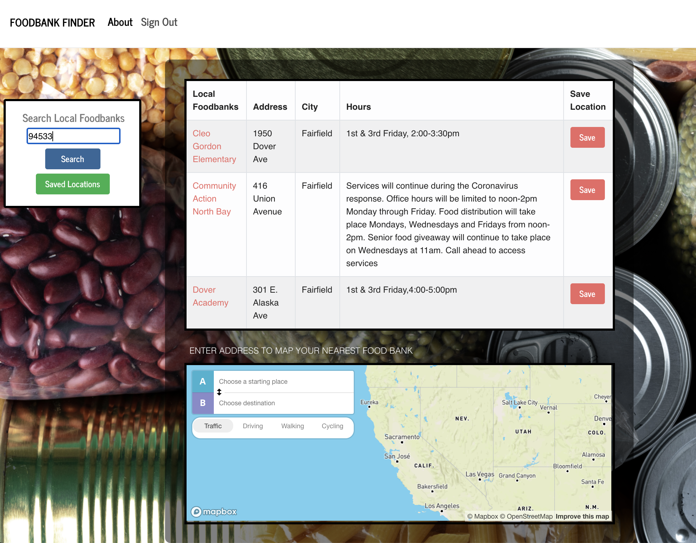
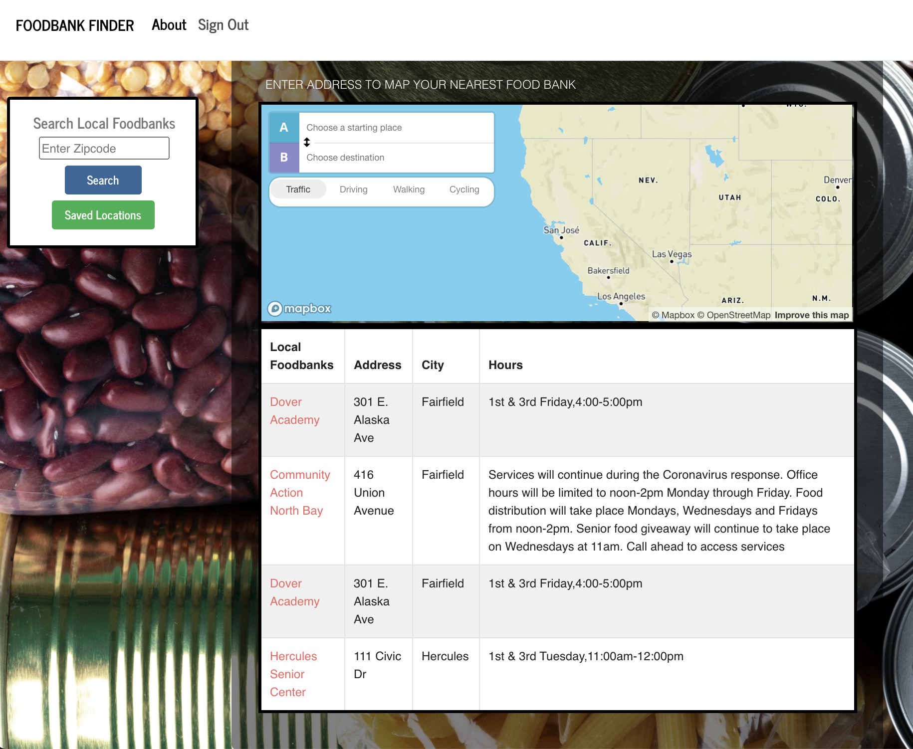

# Food-Bank-Finder

 
  
## Description
Food Bank Finder was created as a tool to encourage generosity and
support those in need. Not just during the holiday season, but year
round. Food Bank Finder connects Californians to food banks near them
that are consistently serving our neighbors. Together we can make the
world a little better and help no one go hungry.  
This app will help you find the top three nearest Food Bank Locations. We have used the [socrata API](https://dev.socrata.com/foundry/controllerdata.lacity.org/v2mg-qsxf) to retrieve the locations by entering the zip code.   
This app comes with the map snippet that can be used interactively to find the directions to the location.

---

[The project can be accessed at my github repository](https://github.com/kaurshalpreetFood-Bank-Finder)

---

[The Link to the deployed app at Heroku](https://calm-ridge-31543.herokuapp.com/)

---

  ## Table of Contents
  1. [Prerequisites](#Prerequisites)
  1. [Installation](#Installation)
  1. [Usage](#Usage)
  1. [Credits](#Credits)
  1. [Collaborators](#Collaborators)
  1. [License](#License)

---

## Prerequisites
* Node.js  
* MongoDB  
* Nodemon  
* create-react-app  

---

## Installation
Steps
1. 'npm i' from the root folder. 
2. To start the app, run "npm run dev" from the root folder in node.
3. In the browser, you can open the app by typing and running at "localhost:3000"
4. Or you can simply click on this [link](https://calm-ridge-31543.herokuapp.com/) to run the deployed Heroku app

---

## Usage
This Project is a Food Bank Locator app that will help you find the nearest three Food Bank Locations. When you open the app, you will have to sign up if you are a new user.

---

Once logged in, you are presented with a search box wherein you can enter the zip code of the desired location. You will be presented with the three nearest Food banks with their address, city, hours of operation, a button to save the location and link to their website(The click on the name of the Food Bank will redirect you to their website).  
The map is also located on this page to provide you directions.

---

On the same page, you are presented with the Saved Locations Button, clicking on which will present you all the saved locations which you have saved in the past.

---

## Credits
* UC Davis BootCamp-Instructors & TAs!
* https://www.w3schools.com/
* https://www.google.com/
* https://www.youtube.com/
* https://github.com/b-bly/simple-mern-passport/
* https://reactjs.org/

---

  ## License
  #### This application is licensed under [The MIT License](https://opensource.org/licenses/MIT)
  
---

  ## Collaborators
  
HALEY LOWE  [Github - halowe94](https://github.com/halowe94)  
AUDRA DAGENAIS [Github - audluc](https://github.com/audluc)  
JAVIER ALBA  [Github - smi13s](https://github.com/smi13s)  
SHALPREET KAUR [Github - kaurshalpreet](https://github.com/kaurshalpreet)  

---

  ## Questions
  #### You can reach me via my [Github](https://github.com/kaurshalpreet) account. 
  #### Email me with any additional questions at: kaurshalpreet@gmail.com

---